# Typescript + React + Mui + Validation Example

> This project is an example of the [react-mui-validation](https://www.npmjs.com/package/react-mui-validation) module.

## Installation

```sh
$ npm install 
```

## Run 

```sh
$ npm run start
```

## Diagram




## [Video](https://youtu.be/1YmzUS1n5k8)
